<div align="center">

# 3D Print Defect Detection

**Automated real-time detection of 3D printing defects using YOLOv9 and YOLOv11**

[](https://python.org)
[](https://pytorch.org)
[](https://docs.ultralytics.com)
[](https://developer.nvidia.com/cuda-toolkit)

*CMU 24-641 Manufacturing Data Analytics · Group 1 · Spring 2026*

</div>

---

## Overview

Fused Deposition Modeling (FDM) 3D printing is prone to failures—**spaghetti**, **stringing**, and **warping**—that waste material, time, and machine hours. In production environments, these defects often go undetected until a print completes, resulting in costly reprints and downtime.

A team of four engineers developed an **end-to-end computer vision pipeline** to detect these defects in real time. The project spans the full ML lifecycle: sourcing and cleaning a dataset, training and comparing state-of-the-art object detection models through systematic hyperparameter sweeps, and deploying the best model in an intuitive desktop GUI for live defect monitoring. 

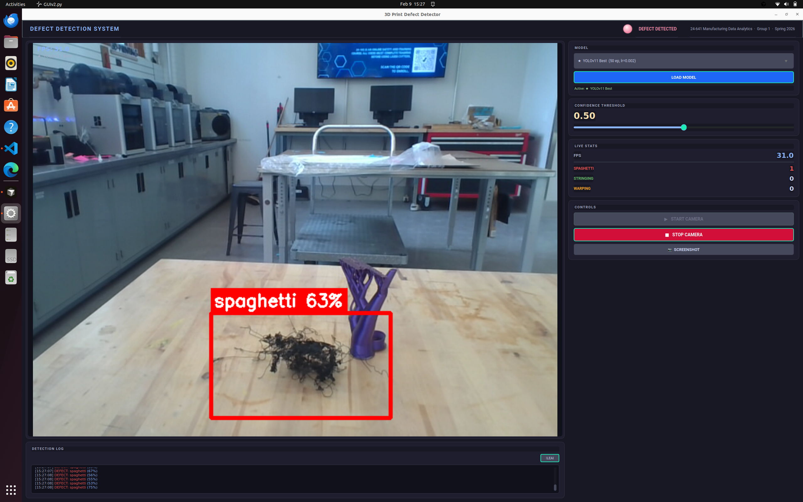

*A demonstration of our model inferencing on an actual defect shown in the image above.*
---

## Defect Classes

We detect three categories of FDM printing defects:

<table>
  <tr>
    <th align="center">Spaghetti</th>
    <th align="center">Stringing</th>
    <th align="center">Warping</th>
  </tr>
  <tr>
    <td>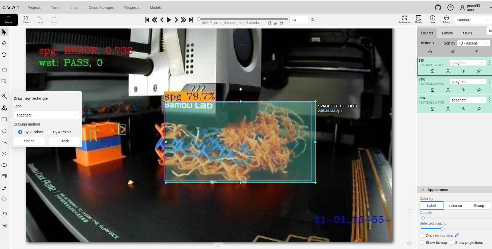</td>
    <td>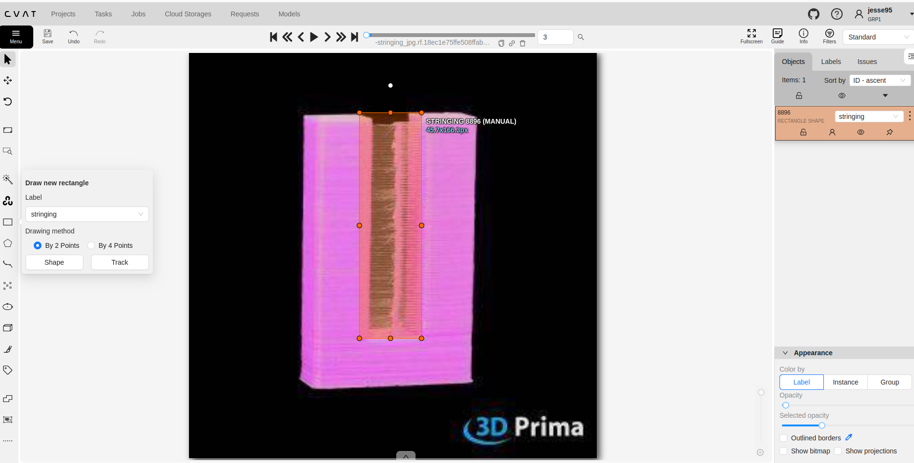</td>
    <td>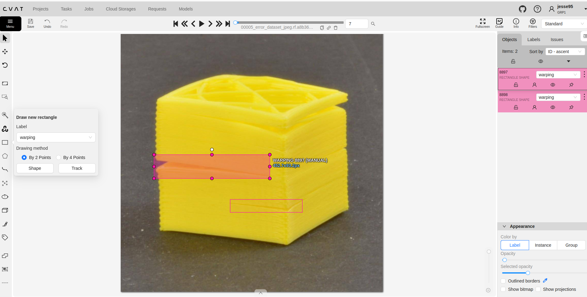</td>
  </tr>
  <tr>
    <td><em>Filament extruded into mid-air when the print detaches from the bed, creating tangled strands</em></td>
    <td><em>Thin wisps of filament stretched between features during nozzle travel moves</em></td>
    <td><em>Corners or edges of the print lift from the bed due to uneven thermal contraction</em></td>
  </tr>
</table>

> The images above show annotations created in CVAT during our data cleaning process. All 15 annotation examples (5 per class) are available in [`docs/cvat_annotations/`](docs/cvat_annotations/).

---

## Dataset

### Source & Acquisition

The base dataset was sourced from [Roboflow Universe — 3D Print Failure Detection](https://universe.roboflow.com/purvi-rathore-5amqh/3d-print-failure-detection-efvsh), containing images of 3D prints with bounding-box annotations for three defect classes.

### Data Cleaning

The raw dataset required **significant manual cleaning** before it was suitable for training. Crowdsourced datasets often contain label noise—mislabeled classes, poorly placed bounding boxes, and ambiguous images—that directly degrades model performance.

Using [CVAT](https://cvat.ai) (Computer Vision Annotation Tool), our team systematically:

- **Reviewed** every image and its annotations for correctness
- **Removed** mislabeled bounding boxes and images with ambiguous or absent defects
- **Re-annotated** images where bounding boxes were misaligned or missing
- **Verified** class label consistency across the entire dataset

This hands-on data curation step was one of the most time-intensive parts of the project, but proved essential for training reliable models.

### Dataset Split

After cleaning, we performed a **stratified 70/15/15 split** to ensure proportional class representation across all partitions. The splitting logic groups images by their primary defect class before dividing, preventing class imbalance across splits.

| Split | Images | Purpose |
|:-----:|:------:|---------|
| Train | 2,419 | Model weight updates |
| Valid | 516 | Hyperparameter tuning & early stopping |
| Test | 523 | Final held-out evaluation |
| **Total** | **3,458** | |

<details>
<summary>Label distribution across the dataset</summary>

<br>

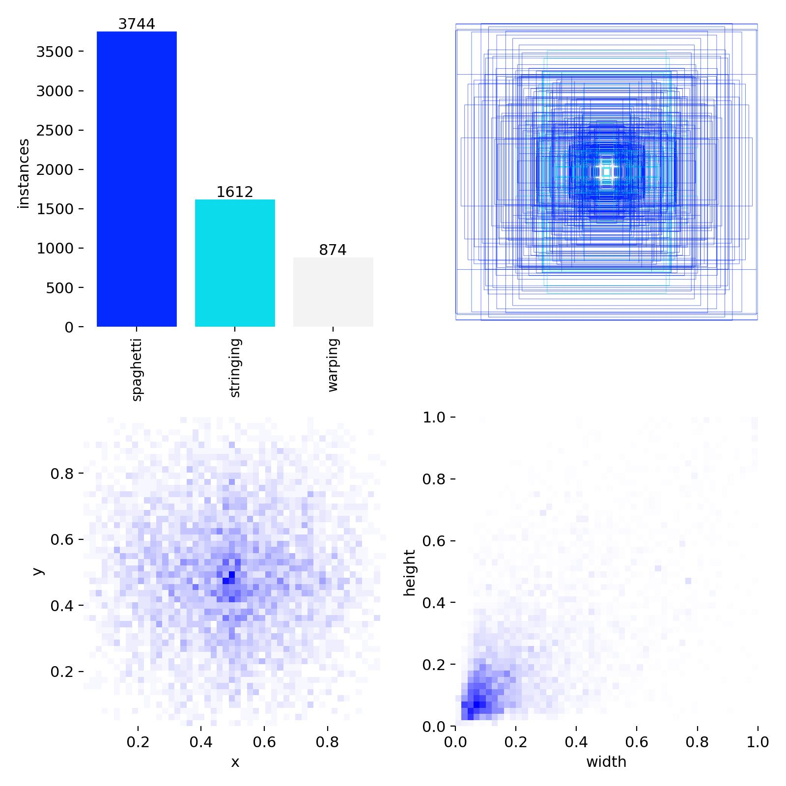

</details>

---

## Training Pipeline

### Architecture

We evaluated two state-of-the-art YOLO architectures:

| Architecture | Key Innovation | Parameters |
|:------------:|----------------|:----------:|
| **YOLOv9s** | Programmable Gradient Information (PGI) | ~7M |
| **YOLOv11s** | Improved C3k2 blocks, attention mechanisms | ~9M |

Both use the **small (s) variant**, balancing detection accuracy with the inference speed needed for real-time deployment.

### Hyperparameter Sweep

We conducted a **systematic 10-experiment sweep** across both architectures, varying learning rate and batch size while holding other parameters constant at 15 epochs each:

| Experiment | Learning Rate | Batch Size | Optimizer | Image Size |
|------------|:------------:|:----------:|:---------:|:----------:|
| Default | 0.01 | 16 | SGD | 640 |
| LR 5x | 0.05 | 16 | SGD | 640 |
| LR 0.2x | 0.002 | 16 | SGD | 640 |
| Batch 8 | 0.01 | 8 | auto | 640 |
| Batch 32 | 0.01 | 32 | auto | 640* |

> *Batch size 32 uses automatic image-size fallback (640 → 576 → 512) to handle GPU memory constraints on our RTX 4060 Laptop GPU (8 GB VRAM).

### Results — 15-Epoch Sweep

| Model | Config | mAP50 | mAP50-95 | Precision | Recall |
|-------|--------|:-----:|:--------:|:---------:|:------:|
| **YOLOv11** | **lr 0.2x** | **0.333** | **0.152** | **0.500** | 0.336 |
| YOLOv9 | lr 0.2x | 0.316 | 0.145 | 0.431 | **0.348** |
| YOLOv11 | Default | 0.286 | 0.122 | 0.385 | 0.325 |
| YOLOv9 | Default | 0.269 | 0.121 | 0.378 | 0.303 |
| YOLOv9 | Batch 32 | 0.256 | 0.113 | 0.346 | 0.288 |
| YOLOv9 | Batch 8 | 0.255 | 0.109 | 0.351 | 0.320 |
| YOLOv11 | Batch 32 | 0.253 | 0.108 | 0.364 | 0.295 |
| YOLOv11 | Batch 8 | 0.238 | 0.104 | 0.328 | 0.268 |
| YOLOv9 | lr 5x | 0.123 | 0.053 | 0.287 | 0.144 |
| YOLOv11 | lr 5x | 0.121 | 0.049 | 0.420 | 0.158 |

**Key finding:** A **lower learning rate (0.2x default)** consistently outperformed all other configurations across both architectures, suggesting the models benefit from slower, more stable convergence on this defect detection task. The aggressive 5x learning rate severely degraded performance, indicating overshooting of optimal weight regions.

### Comparison Plots

<details>
<summary>Six-panel metric comparison — YOLOv9 vs. YOLOv11</summary>

<br>

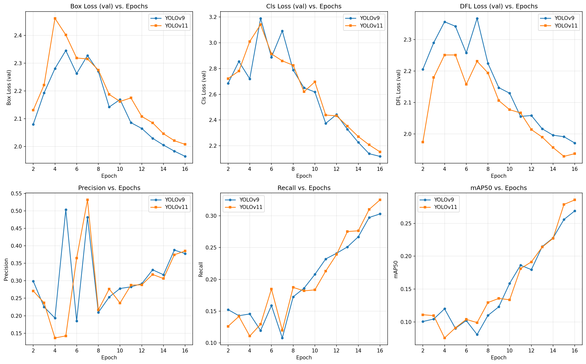

</details>

<details>
<summary>Learning rate comparison</summary>

<br>

**YOLOv11**
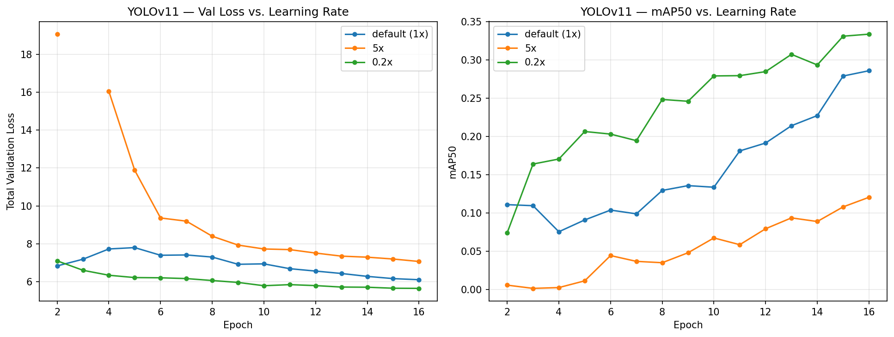

**YOLOv9**
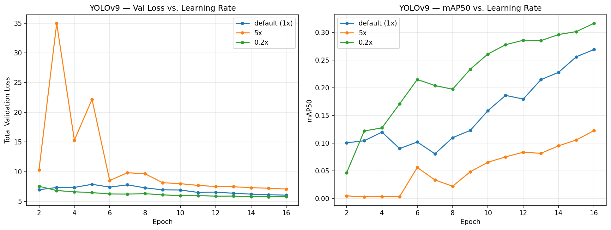

</details>

<details>
<summary>Batch size comparison</summary>

<br>

**YOLOv11**
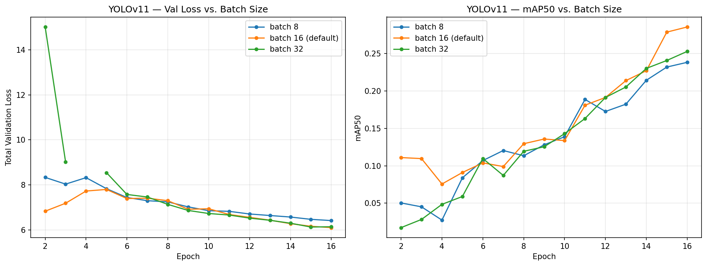

**YOLOv9**
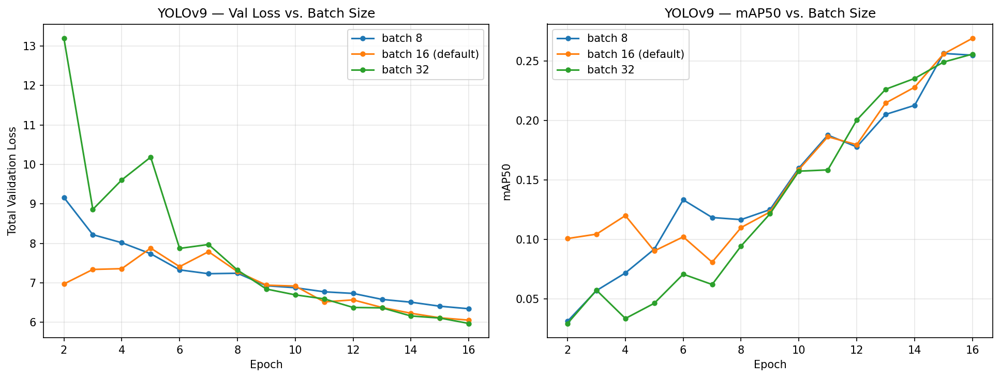

</details>

---

## Best Model — Extended Training

Based on the sweep results, we selected **YOLOv11s with SGD at lr=0.002 (0.2x)** as our best configuration and extended training to **50 epochs** to push accuracy higher. YOLOv11 was also preferred for its faster inference time (~18 ms/image vs. ~27 ms for YOLOv9), which is critical for real-time deployment.

### Test Set Evaluation

| Metric | Value |
|--------|:-----:|
| **mAP50** | 0.407 |
| **mAP50-95** | 0.223 |
| **Precision** | 0.596 |
| **Recall** | 0.230 |
| **Inference Speed** | ~35 ms/image |
| True Positives | 533 |
| False Positives | 68 |
| False Negatives | 846 |

> Extended training improved mAP50 from 0.333 → 0.407 (+22%) and precision from 0.500 → 0.596 (+19%) compared to the 15-epoch baseline, confirming the model had not yet converged at 15 epochs.

<details>
<summary>Confusion matrix (normalized)</summary>

<br>

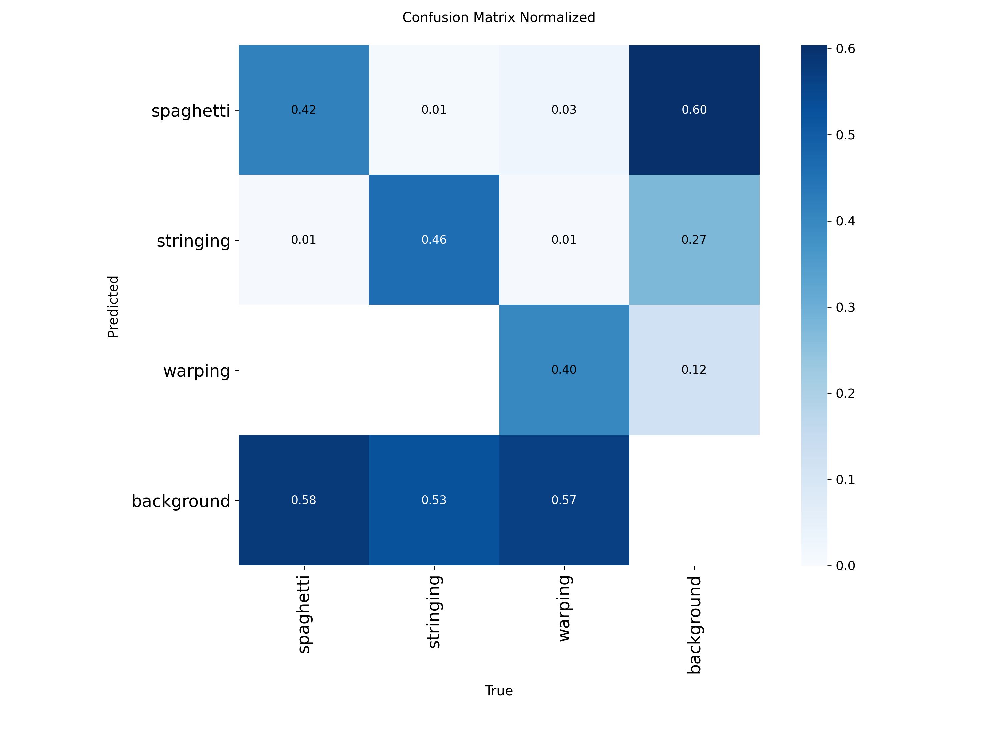

</details>

<details>
<summary>Training curves — 50 epochs</summary>

<br>

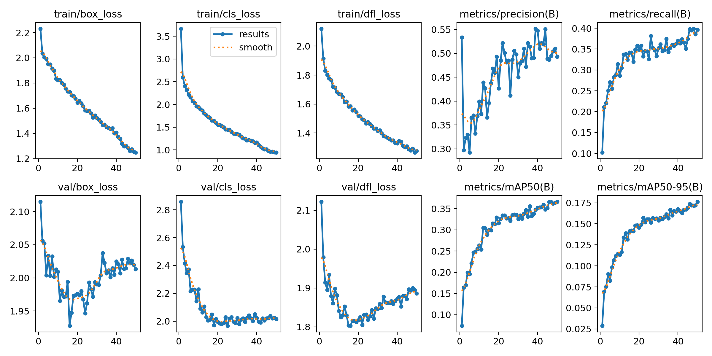

</details>

<details>
<summary>Precision-Recall curve</summary>

<br>

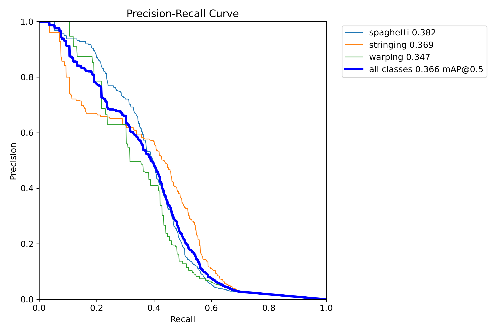

</details>

---

## Real-Time Detection GUI

To make the trained model accessible to operators without machine learning expertise, we built a **real-time defect detection GUI**. Our initial prototype was developed using CustomTkinter (`defect_detector_gui.py`), which validated the core functionality. We then redesigned the interface from scratch using **PySide6** with the **qt-material** theme library (`GUIv2.py`) for a more polished, professional experience suitable for live demonstrations.

### Features

- **Live camera feed** with bounding-box overlays color-coded by defect class
- **Model selector** — switch between any of the 11 trained model variants
- **LED alert indicator** — green when clear, red when a defect is detected
- **Adjustable confidence threshold** via real-time slider
- **Live FPS counter** and per-class detection counts
- **Screenshot capture** for documentation and reporting
- **Scrollable detection log** with timestamped entries

### GUI Architecture

```
Camera Feed → YOLO Inference (background thread) → Qt Signal Bridge → UI Update
```

The GUI runs inference in a separate thread to keep the UI responsive, communicating results to the main Qt event loop via a signal bridge pattern.

---

## Project Structure

```
├── train_models.py            # Hyperparameter sweep — 10 experiments across 2 architectures
├── train_best_model.py        # Extended training of best config (50 epochs)
├── split_dataset.py           # Stratified dataset splitting (70/15/15)
├── GUIv2.py                   # Real-time detection GUI (PySide6 + Material Design)
├── defect_detector_gui.py     # Initial GUI prototype (CustomTkinter)
├── generate_model_report.py   # Automated PDF report generation
├── generate_part1_report.py   # Dataset preparation report generator
├── build_cvat_zips.py         # CVAT YOLO 1.1 format export utility
│
├── data.yaml                  # YOLO dataset configuration
├── results_summary.json       # Complete experiment metrics (JSON)
├── requirements.txt           # Python dependencies
│
├── plots/                     # Training comparison charts
│   ├── six_panel_comparison.png
│   ├── val_loss_vs_epochs.png
│   ├── mAP50_95_vs_epochs.png
│   └── *_lr_comparison.png / *_batch_comparison.png
│
├── docs/
│   ├── cvat_annotations/      # 15 CVAT annotation screenshots (5 per class)
│   └── results/               # Best model outputs — confusion matrix, PR curves
│
└── reports/
    └── Group1_24-641_Project1_Model_S26.pdf
```

> **Note:** The dataset (~588 MB), model weights (~370 MB), and pretrained checkpoints are excluded from this repository due to size. See [Getting Started](#getting-started) for reproduction instructions.

---

## Getting Started

### Prerequisites

- Python 3.11+
- NVIDIA GPU with CUDA support (tested on RTX 4060 Laptop, 8 GB VRAM)
- Webcam (for real-time detection GUI)

### Installation

```bash
git clone https://github.com/jabarkle/Defect-Detection.git
cd Defect-Detection

# Create environment (conda recommended)
conda create -n defect-detection python=3.13
conda activate defect-detection

pip install -r requirements.txt
```

### Dataset Setup

The dataset is not included due to size constraints. To reproduce:

1. Download the base dataset from [Roboflow Universe](https://universe.roboflow.com/purvi-rathore-5amqh/3d-print-failure-detection-efvsh)
2. Clean and annotate using [CVAT](https://cvat.ai) (see our annotation examples in `docs/cvat_annotations/`)
3. Run the stratified split:

```bash
python split_dataset.py
```

### Training

```bash
# Full hyperparameter sweep — 10 experiments (~2-3 hours on RTX 4060)
python train_models.py

# Quick sanity check (3 epochs)
python train_models.py --quick

# Re-generate plots from existing results
python train_models.py --plots

# Extended training of best model — 50 epochs
python train_best_model.py
```

### Run the Detection GUI

```bash
python GUIv2.py
```

> Model weights must be trained first (or obtained separately) before the GUI can load a model.

---

## Hardware

| Component | Specification |
|-----------|---------------|
| GPU | NVIDIA GeForce RTX 4060 Laptop (8 GB VRAM) |
| CUDA | 12.8 |
| PyTorch | 2.8.0+cu128 |
| OS | Ubuntu Linux 6.8 |

---

## Team

**CMU 24-641 Manufacturing Data Analytics — Group 1 — Spring 2026**

| Name |
|------|
| Jesse Barkley |
| Tom Wei |
| Ryan Kaichain |
| Maciej Sobolewski |
